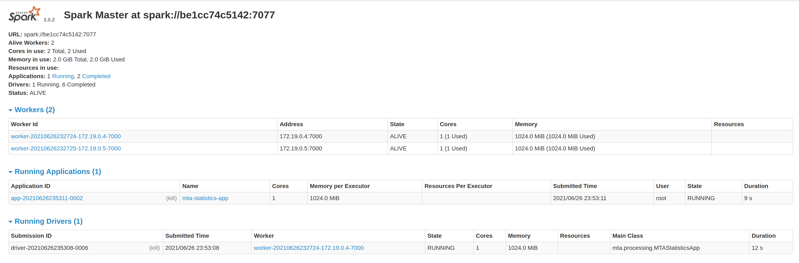

# Cluster com Spark e Docker Compose

# General

Um cluster autônomo simples do Spark para fins de ambiente de teste. Uma solução docker-compose up away from you para o seu ambiente de desenvolvimento Spark.

O docker compose criará os seguintes contêineres:

container|Portas expostas
---|---
spark-master|9090 7077
spark-worker-1|9091
spark-worker-2|9092
demo-database|5432

# Instalação

As etapas a seguir farão com que você execute os contêineres do cluster Spark.

## Pré-requisitos

* Docker instalado

* Composição do Docker instalada

## Construa a imagem


```sh
docker build -t cluster-apache-spark:3.0.2 .
```

## Execute o docker-compose

A etapa final para criar seu cluster de teste será executar o arquivo de composição:

```sh
docker-compose up -d
```

## Valide seu cluster

Basta validar seu cluster acessando a interface do usuário do Spark em cada URL de trabalho e mestre.

### Spark Master

http://localhost:9090/


### Spark Worker 1

http://localhost:9091/


### Spark Worker 2

http://localhost:9092/


# Alocação de recursos

Este cluster é fornecido com três trabalhadores e um spark master, cada um deles com um conjunto específico de alocação de recursos (basicamente RAM e alocação de núcleos de CPU).

* A alocação padrão de núcleos de CPU para cada spark worker é 1 núcleo.

* A RAM padrão para cada spark-worker é 1.024 MB.

* A alocação de RAM padrão para executores Spark é 256 MB.

* A alocação de RAM padrão para o driver Spark é 128 MB

* Se você deseja modificar essas alocações, basta editar o arquivo env/spark-worker.sh.

# Volumes vinculados

Para facilitar a execução do aplicativo, enviei duas montagens de volume descritas no gráfico a seguir:

Montagem de host|Montagem de contêiner|Objetivo
---|---|---
apps|/opt/spark-apps|Usado para disponibilizar os jars do seu aplicativo em todos os workers e master
data|/opt/spark-data| Usado para disponibilizar os dados do seu aplicativo em todos os workers e master

Este é basicamente um DFS fictício criado a partir de volumes do docker... (talvez não...)

# Execute aplicativos de amostra


## Dados de pontos de ônibus de NY [Pyspark]

Este programa apenas carrega dados arquivados do [MTA Bus Time](http://web.mta.info/developers/MTA-Bus-Time-historical-data.html) ae aplica filtros básicos usando spark sql, o resultado é persistido em uma tabela postgresql.

A tabela carregada conterá a seguinte estrutura:

latitude|longitude|time_received|vehicle_id|distance_along_trip|inferred_direction_id|inferred_phase|inferred_route_id|inferred_trip_id|next_scheduled_stop_distance|next_scheduled_stop_id|report_hour|report_date
---|---|---|---|---|---|---|---|---|---|---|---|---
40.668602|-73.986697|2014-08-01 04:00:01|469|4135.34710710144|1|IN_PROGRESS|MTA NYCT_B63|MTA NYCT_JG_C4-Weekday-141500_B63_123|2.63183804205619|MTA_305423|2014-08-01 04:00:00|2014-08-01

Para enviar o aplicativo conecte-se a um dos trabalhadores ou ao mestre e execute:

```sh
/opt/spark/bin/spark-submit --master spark://spark-master:7077 \
--jars /opt/spark-apps/postgresql-42.2.22.jar \
--driver-memory 1G \
--executor-memory 1G \
/opt/spark-apps/main.py
```


## Análise de ônibus MTA[Scala]

Este programa pega os dados arquivados do [MTA Bus Time](http://web.mta.info/developers/MTA-Bus-Time-historical-data.html) e faz algumas agregações neles, os resultados calculados são persistidos nas tabelas postgresql.

Cada tabela persistente corresponde a uma agregação específica:

Table|Aggregation
---|---
day_summary|Um resumo dos relatórios de veículos, paradas visitadas, velocidade média e distância percorrida (todos os veículos)
speed_excesses|Excessos de velocidade calculados em uma janela de 5 minutos
average_speed|Velocidade média por veículo
distance_traveled|Distância total percorrida pelo veículo


Para enviar o aplicativo conecte-se a um dos trabalhadores ou ao mestre e execute:

```sh
/opt/spark/bin/spark-submit --deploy-mode cluster \
--master spark://spark-master:7077 \
--total-executor-cores 1 \
--class mta.processing.MTAStatisticsApp \
--driver-memory 1G \
--executor-memory 1G \
--jars /opt/spark-apps/postgresql-42.2.22.jar \
--conf spark.driver.extraJavaOptions='-Dconfig-path=/opt/spark-apps/mta.conf' \
--conf spark.executor.extraJavaOptions='-Dconfig-path=/opt/spark-apps/mta.conf' \
/opt/spark-apps/mta-processing.jar
```

Você notará no spark-ui um programa driver e um programa executor em execução (no scala podemos usar cluster em modo de implantação)




# Resumo

* Compilamos a imagem do docker necessária para executar contêineres spark master e trabalhadores.

* Criamos um cluster autônomo Spark usando 2 nós de trabalho e 1 nó mestre usando docker && docker-compose.

* Copiou os recursos necessários para executar aplicativos de demonstração.

* Executamos um aplicativo distribuído em casa (só precisamos de núcleos de CPU e RAM suficientes para fazer isso).

# Por que um cluster independente?

* O objetivo é ser usado para fins de teste, basicamente uma forma de executar aplicativos Spark distribuídos em seu laptop ou desktop.

* Isso será útil para usar pipelines de CI/CD para seus aplicativos Spark (um tópico realmente difícil e importante)

# Etapas para conectar e usar um shell pyspark interativamente

* Siga as etapas para executar o arquivo docker-compose. Você pode reduzir isso, se necessário, para 1 trabalhador.

```sh
docker-compose up --scale spark-worker=1
docker exec -it docker-spark-cluster_spark-worker_1 bash
apt update
apt install python3-pip
pip3 install pyspark
pyspark
```

# O que resta fazer?

* No momento, para executar aplicativos no cluster em modo de implantação, é necessário especificar uma porta de driver arbitrária.

* A entrada spark submit no start-spark.sh não está implementada, o envio usado nas demonstrações pode ser acionado por qualquer trabalhador